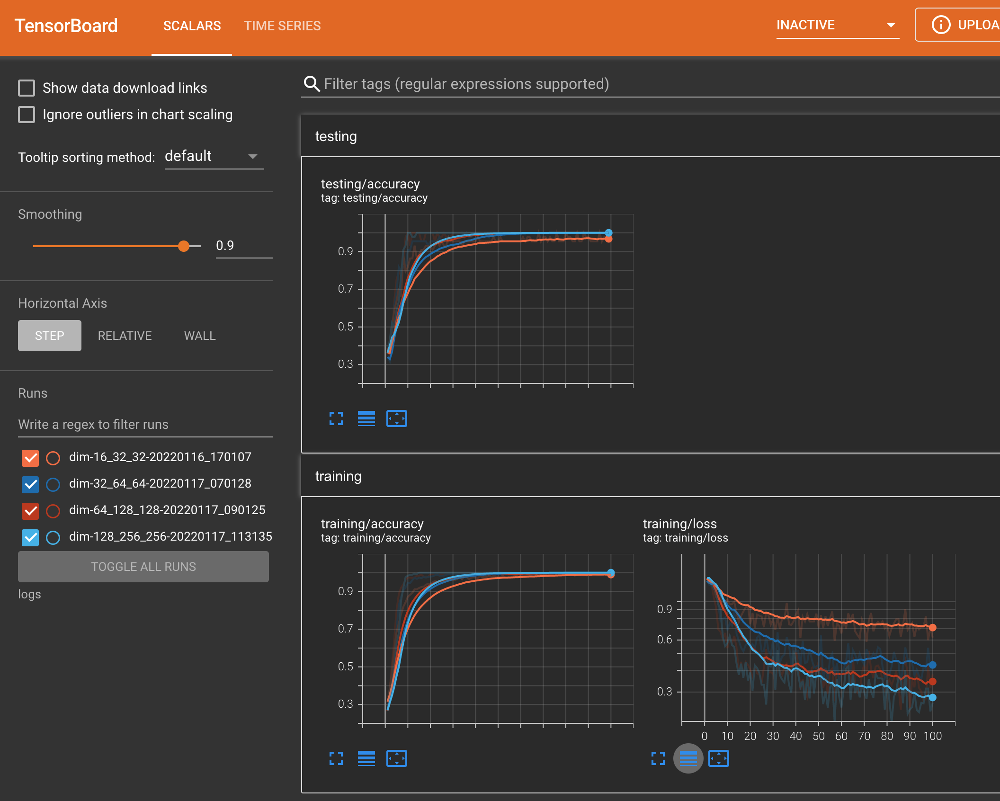

# SIGNATE:【練習問題】モノクロ顔画像の感情分類

- https://signate.jp/competitions/404


# 特徴

- PyTorch
- torchvision.transform を使ったデータの水増し(Data Argumentation)
- CUDA環境下ではGPUを使用した学習
- マルチプロセス、並列処理による高速な学習
- tensorboardによる学習状況閲覧



# Clone

```
git clone https://github.com/kose/facial-expression-classification.git
mkdir facial-expression-classification/logs
mkdir facial-expression-classification/result
```

# データセット

- [データダウンロード](https://signate.jp/competitions/404/data)

```
cd facial-expression-classification/db
unzip -x train.zip
unzip -x test.zip
./00make_dataset.sh

プレビュー
python dataset.py
```


# tensorboardを起動

```
./00server.sh
```

ブラウザで [http://localhost:6006/](http://localhost:6006/) を開く


# 学習

```
python train.py 
```

シェルスクリプト 00train.sh を見てください。
